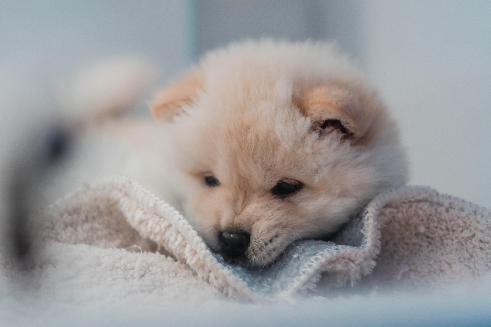
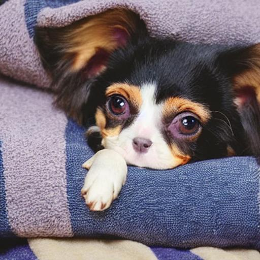
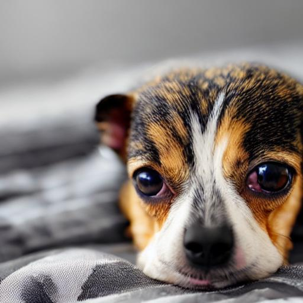
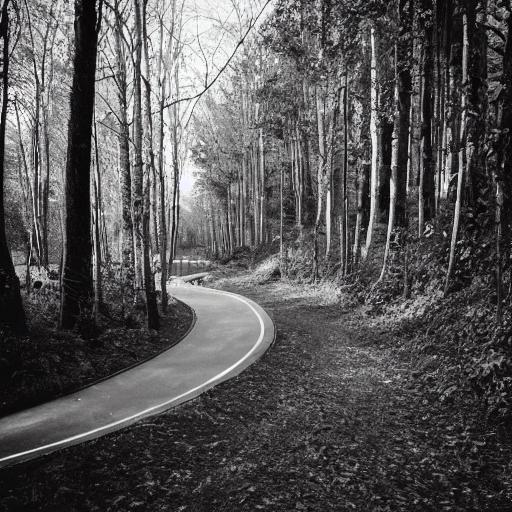
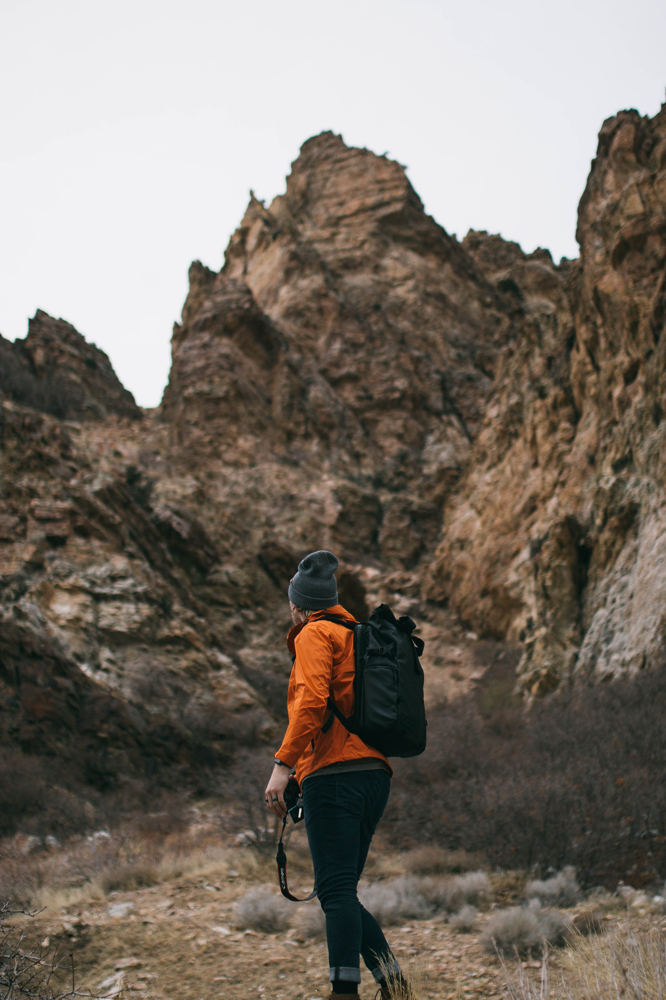
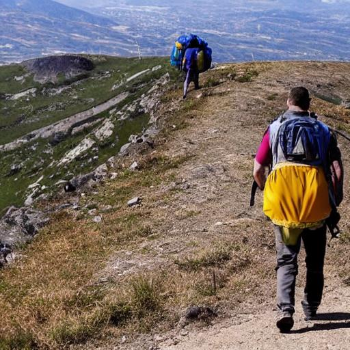

# Finetuning Stable Diffusion: A Tutorial

# Dataset
Please download the unsplash-lite dataset from [here](https://github.com/unsplash/datasets). Since we will be finetuning it in HF text to image script, we will need to convert it into a particular format mentioned [here](https://huggingface.co/docs/datasets/image_dataset#imagefolder). The format will look like this
```
imagefolder/
|--- train/
     |--- image1.jpg
     |--- image2.jpg
     |--- image3.jpg
     |--- metadata.jsonl
```

The format for `metadata.jsonl` will look like this
```json
{"file_name": "/home/ubuntu/projects/finetune-sd/images/iibjsy2QFEE.jpg", "text": "there is a pink flower that is in a vase on a table"}
{"file_name": "/home/ubuntu/projects/finetune-sd/images/okb9GB_O6w0.jpg", "text": "there is a close up of a cat with a blurry background"}
{"file_name": "/home/ubuntu/projects/finetune-sd/images/3Xi_PcsmlqI.jpg", "text": "there is a brown dog sitting on a couch with a yellow pillow"}
{"file_name": "/home/ubuntu/projects/finetune-sd/images/TvF_tbXRTV8.jpg", "text": "there are two bikes that are standing in the sand at sunset"}
```


# Training

For training, we are going to follow the huggingface docs [here](https://huggingface.co/docs/diffusers/training/text2image#finetuning). We are going to use the `runwayml/stable-diffusion-v1-5` checkpoint. We are going to finetune it on the Unsplash lite dataset as mentioned above. I have put the long bash command in the `finetune.sh` file. The description of each parameters are as follows:
## Finetune Parameters Description

This script is used to launch a training process for a text-to-image model using the Accelerate library. The parameters used in this script are described below:

- `MODEL_NAME`: The name or path of the pretrained model to use for training. It is set as an environment variable and used in the script.

- `dataset_name`: The directory path where the training data is located. It is also set as an environment variable and used in the script.

- `--pretrained_model_name_or_path`: This parameter is set to the pretrained model name or path specified by the `MODEL_NAME` environment variable.

- `--train_data_dir`: This parameter is set to the directory specified by the `dataset_name` environment variable, where the training data is located.

- `--use_ema`: Use exponential moving average for the model parameters, which can help improve the model's performance.

- `--resolution`: The resolution to use for the images during training. In this script, it is set to 512.

- `--center_crop`: Apply center cropping to the images during preprocessing.

- `--random_flip`: Apply random flipping to the images during preprocessing.

- `--train_batch_size`: The batch size to use during training. In this script, it is set to 1.

- `--gradient_accumulation_steps`: The number of steps to accumulate gradients before updating the model parameters. In this script, it is set to 4.

- `--gradient_checkpointing`: Enables gradient checkpointing, which can reduce the memory usage during training at the cost of a slight increase in computation time.

- `--max_train_steps`: The maximum number of training steps. In this script, it is set to 150.

- `--learning_rate`: The learning rate to use during training. In this script, it is set to 1e-05.

- `--max_grad_norm`: The maximum norm of the gradients for gradient clipping. In this script, it is set to 1.

- `--lr_scheduler`: The learning rate scheduler to use during training. In this script, it is set to "constant".

- `--lr_warmup_steps`: The number of warmup steps to use for the learning rate scheduler. In this script, it is set to 0.

- `--output_dir`: The directory to save the outputs of the training. In this script, it is set to "unsplash-lite-v1".

# Checkpoint Location
Checkpoint is uploaded at HF models [here](https://huggingface.co/maiti/unsplash-finetuned-v1/).
# Quantitative Evaluation on Test Set

Following is the score comparison between the original and finetuned model for FID score and the LPIPS score.

| Model | LPIPS Score | FID Score |
| --- | --- | --- |
| Original Model | 0.714365 | 274.49 |
| Finetuned Model | 0.686741 | 288.79 |

I have calculated the LPIPS score using [richzhang/PerceptualSimilarity](https://github.com/richzhang/PerceptualSimilarity) and FID score using [mseitzer/pytorch-fid](https://github.com/mseitzer/pytorch-fid).


# Qualitative Results on Test Set

| Image Name : LPIPS Score| Ground Truth | Original Model | Finetuned Model |
| --- | --- | --- | --- |
| 5S3YHJMPpB8.jpg: 0.810 |  |  |  |
| 5vc0dWJp05Y.jpg: 0.820 |  |  |  |
| uG5DYq4Ur04.jpg: 0.773 |  |  |  |
| C2UUFseZ8Lk.jpg: 0.657 |  |  |  |
| pCv_JJmYLRc.jpg: 0.737 |  |  |  |
| uxC4Lqa1MSo.jpg: 0.643 |  |  |  |
| PAnGAiaSPh0.jpg: 0.719 |  |  |  |
| eWuc6TXc8Ok.jpg: 0.701 |  |  |  |
| MqlbnO4W8ZE.jpg: 0.665 |  |  |  |
| _Ui26s8zR_c.jpg: 0.618 |  |  |  |


# What can we conclude?

We can see that even though LPIPS score is better for the finetuned model, FID score is higher. Since these are perceptual distance metric, the lower, the better. Hence, there is a lot of scope of improvement. Due to time limitations, we could only train for few steps. But ideally, we can finetune for more steps, ideally 15000 steps is recommended in the original script. Also, we can do various hyperparameter tuning, on the learning rate and other finetuning parameters. During sampling, we can experiment with various diffusion steps.

Also, the original SD 1.5 model has used CLIP Text encoder. Using [CLIP Interrogator](https://huggingface.co/spaces/pharma/CLIP-Interrogator) may have fetched better results, with prompts in line with CLIP embeddings.
